# RFC: Kubernetes Off Hours Staging Resource Optimization

**RFC Number:** 001  
**Title:** Kubernetes Off Hours Staging Resource Optimization  
**Status:** Draft  
**Author:** DevOps Team  
**Created:** 2024-12-01  
**Updated:** 2024-12-01  

## Summary

This RFC proposes implementing an automated Kubernetes resource optimization system using kube-green operator to reduce staging environment costs by 60-80% during off-hours while maintaining seamless developer experience through GitOps workflows and Slack integration.

## Motivation

### Current State

Our staging Kubernetes clusters consume significant resources 24/7, even during off-hours when no active development occurs. This results in:

- **High Infrastructure Costs**: Continuous resource allocation in non-production environments
- **Resource Waste**: CPU, memory, and storage utilization drops to near-zero during evenings and weekends
- **Manual Overhead**: Current resource management requires constant human intervention
- **Inconsistent Practices**: Teams manually scale resources with varying success and reliability
- **Environmental Impact**: Unnecessary carbon footprint from idle infrastructure

### Business Impact

**Current Cost Analysis:**
- Staging environment operational costs: $15,000/month
- Peak utilization hours: 8 AM - 6 PM weekdays (50 hours/week)
- Off-hours: 6 PM - 8 AM weekdays + weekends (118 hours/week)
- Current off-hours utilization: <5%
- Estimated monthly waste: $10,500 (70% of staging costs)

**Proposed Solution Benefits:**
- **Cost Reduction**: 60-80% savings during off-hours
- **Developer Experience**: Zero-friction automated scaling
- **Operational Efficiency**: Reduced manual intervention
- **Environmental Impact**: Significant carbon footprint reduction
- **Scalability**: Foundation for multi-environment optimization

## Detailed Design

### Architecture Overview

```mermaid
graph TB
    subgraph "GitOps Workflow"
        A[GitLab Repository] --> B[ArgoCD]
        B --> C[Kubernetes Cluster]
    end
    
    subgraph "Core Components"
        C --> D[kube-green Operator]
        D --> E[SleepInfo CRDs]
        E --> F[Staging Workloads]
    end
    
    subgraph "Integration Layer"
        D --> G[Slack Webhook Service]
        G --> H[Slack Channel]
        H --> I[Manual Override Buttons]
        I --> J[GitLab API]
        J --> A
    end
    
    subgraph "Observability"
        K[Prometheus] --> L[Grafana Dashboards]
        K --> M[AlertManager]
        D --> K
        G --> K
    end
    
    style D fill:#00D4AA
    style G fill:#4A154B
    style K fill:#E6522C
```



### Component Specifications

#### 1. kube-green Operator
- **Technology**: [kube-green v0.5.1](https://github.com/kube-green/kube-green)
- **Deployment**: Kubernetes operator with CRD-based configuration
- **Scheduling**: Cron-based time triggers for sleep/wake operations
- **Scope**: Namespace-aware with configurable resource targeting

#### 2. Resource Optimization Strategy

**Time-Based Scheduling:**
```yaml
# Weekday Schedule
weekdaysSleepAt: "18:00"    # 6 PM
weekdaysWakeUpAt: "08:00"   # 8 AM
# Savings: 14 hours/day = 58% daily reduction

# Weekend Schedule  
weekendsSleepAt: "18:00"    # Friday 6 PM
weekendsWakeUpAt: "08:00"   # Monday 8 AM
# Savings: 62 hours = 100% weekend reduction
```

**Tiered Resource Management:**
1. **Background Services** (Priority 1): Sleep at 18:00
   - Workers, schedulers, batch processors
2. **Web Services** (Priority 2): Sleep at 19:00
   - Frontend, API, web servers
3. **Data Services** (Priority 3): Sleep at 20:00
   - Cache, search, analytics (databases excluded)

#### 3. Slack Integration Service

**Technology Stack:**
- **Language**: Go/Python microservice
- **API Integration**: Slack Bolt SDK
- **Deployment**: Kubernetes Deployment with 3 replicas
- **Security**: RBAC, network policies, secret management

**Capabilities:**
- Interactive slash commands (`/k8s-wake`, `/k8s-sleep`, `/k8s-status`)
- Real-time notifications for state changes
- Manual override buttons with confirmation flows
- User permission management and audit logging

#### 4. GitOps Integration

**Workflow:**
```
Manual Override → Slack Service → GitLab API → Repository Update → 
ArgoCD Sync → Kubernetes Apply → Resource State Change → 
Status Notification → Slack Channel
```

**ArgoCD Applications:**
- `kube-green-operator`: Core operator deployment
- `kube-green-staging`: Staging environment configuration
- `kube-green-production`: Production environment configuration
- `slack-webhook-service`: Integration service deployment
- `monitoring-stack`: Observability components

#### 5. Monitoring and Observability

**Metrics Collection:**
- Resource utilization before/after optimization
- Cost savings per environment and time period
- Sleep/wake operation success rates
- Manual override frequency and triggers
- System component health and performance

**Dashboards:**
- Cost optimization tracking
- Resource utilization trends
- Operational health monitoring
- User activity and audit trails

**Alerting:**
- Failed sleep/wake operations
- Manual override thresholds exceeded
- System component failures
- Cost anomaly detection

### Security Considerations

#### Access Control
- **RBAC**: Kubernetes role-based access control for all components
- **Slack Permissions**: Role-based command access (developer, devops, admin)
- **GitLab Tokens**: Limited scope API tokens with minimal required permissions
- **ArgoCD Access**: Project-based permissions with environment restrictions

#### Network Security
- **Network Policies**: Micro-segmentation for service isolation
- **TLS Encryption**: All communications encrypted in transit
- **Secret Management**: External secret operators (ESO) integration
- **Webhook Security**: Slack signature verification and rate limiting

#### Audit and Compliance
- **Comprehensive Logging**: All operations logged with user attribution
- **Audit Trails**: GitOps-based change tracking
- **Compliance Reports**: Monthly cost and operational efficiency reports
- **Security Scanning**: Container and configuration security validation

### Implementation Phases

#### Phase 1: Foundation (Week 1-2)
**Deliverables:**
- GitLab repository setup with complete structure
- kube-green operator deployment and configuration
- Basic SleepInfo resources for staging environment
- Initial scheduling policies implementation

**Success Criteria:**
- Operator successfully deployed and operational
- Staging resources automatically sleep/wake on schedule
- Basic cost savings measurable (>50% during off-hours)

#### Phase 2: Integration (Week 3-4)
**Deliverables:**
- Slack webhook service deployment
- Interactive slash commands implementation
- Manual override functionality
- ArgoCD applications and GitOps workflow

**Success Criteria:**
- Slack commands functional for all environments
- Manual overrides working with GitLab integration
- ArgoCD sync policies operational
- Real-time notifications in Slack channels

#### Phase 3: Enhancement (Week 5-6)
**Deliverables:**
- Monitoring stack deployment (Prometheus, Grafana, AlertManager)
- Cost tracking dashboards
- Advanced scheduling features (holidays, custom overrides)
- Comprehensive alerting rules

**Success Criteria:**
- Monitoring dashboards showing real-time cost savings
- Alert system operational for all failure scenarios
- Advanced scheduling working for holiday periods
- Performance metrics meeting SLA requirements

#### Phase 4: Production Ready (Week 7-8)
**Deliverables:**
- Production environment deployment
- Security hardening and compliance validation
- User training and documentation
- Performance optimization and tuning

**Success Criteria:**
- Production deployment successful with zero downtime
- Security audit passed with no critical findings
- User adoption >80% for staging environment
- Cost savings targets achieved (60-80% reduction)

## Rationale

### Technology Selection

**kube-green Operator:**
- ✅ Kubernetes-native CRD-based approach
- ✅ Active community and regular updates
- ✅ Production-ready with proven track record
- ✅ Flexible scheduling and resource targeting
- ❌ Limited enterprise support options

**Alternative Considered - Custom Solution:**
- ✅ Complete control over functionality
- ✅ Custom enterprise features
- ❌ Significant development and maintenance overhead
- ❌ Longer time to market
- ❌ Higher risk of bugs and security issues

**Alternative Considered - Cloud Provider Solutions:**
- ✅ Native cloud integration
- ✅ Enterprise support included
- ❌ Vendor lock-in
- ❌ Limited customization options
- ❌ Higher costs for multi-cloud environments

### GitOps Approach
**Benefits:**
- **Audit Trail**: All changes tracked in Git with full history
- **Declarative**: Infrastructure as code principles
- **Rollback**: Easy reversion of problematic changes
- **Collaboration**: Standard Git workflows for team collaboration
- **Security**: Code review process for all infrastructure changes

### Slack Integration Choice
**Benefits:**
- **Developer Adoption**: Leverages existing communication platform
- **Real-time**: Immediate notifications and responses
- **Mobile Support**: Access from anywhere via Slack mobile app
- **Permissions**: Built-in user management and role controls
- **Audit**: Complete interaction history in Slack

## Prior Art

### Industry Solutions

**1. KEDA (Kubernetes Event-Driven Autoscaler)**
- Focus: Event-driven scaling based on metrics
- Use Case: Production workload optimization
- Difference: Our focus is on scheduled time-based optimization for non-production

**2. Vertical Pod Autoscaler (VPA)**
- Focus: Right-sizing individual pod resources
- Use Case: Optimizing resource requests/limits
- Difference: Our focus is on complete workload sleep/wake cycles

**3. Cluster Autoscaler**
- Focus: Node-level scaling based on resource demands
- Use Case: Infrastructure elasticity
- Difference: Our focus is on application-level scheduling

### Similar Implementations

**Netflix's Cost Optimization:**
- Automated instance scheduling for development environments
- Estimated 40-60% cost savings on non-production workloads
- Similar business drivers and outcomes

**Spotify's Resource Management:**
- Custom tooling for non-production environment lifecycle management
- GitOps-based deployment with Slack integration
- Similar technical approach and developer experience

**Airbnb's Infrastructure Optimization:**
- Scheduled scaling for test and staging environments
- Focus on developer productivity and cost efficiency
- Similar metrics and success criteria

## Unresolved Questions

### Technical Questions

1. **Cross-Service Dependencies**: How do we handle complex service dependency chains during wake-up sequences?
   - **Investigation Needed**: Dependency mapping and orchestration
   - **Proposed Solution**: Phased wake-up with health checks

2. **Database State Management**: How do we handle database sleep/wake cycles for stateful workloads?
   - **Investigation Needed**: Database-specific sleep strategies
   - **Proposed Solution**: Exclude databases, focus on application layer

3. **Persistent Volume Claims**: How do we handle PVC lifecycle during extended sleep periods?
   - **Investigation Needed**: Storage cost optimization strategies
   - **Proposed Solution**: PVC exclusion with separate storage optimization

### Operational Questions

1. **Emergency Procedures**: What happens if automatic wake-up fails during critical demos or incidents?
   - **Proposed Solution**: Multiple manual override methods and escalation procedures

2. **Cost Tracking Accuracy**: How do we accurately measure and attribute cost savings?
   - **Proposed Solution**: Integration with cloud provider billing APIs and resource tagging

3. **User Adoption**: How do we ensure teams adopt and properly use the system?
   - **Proposed Solution**: Training program, documentation, and gradual rollout

### Business Questions

1. **ROI Validation**: How do we measure and validate the actual cost savings achieved?
   - **Proposed Solution**: Monthly cost reports with before/after analysis

2. **Developer Productivity Impact**: How do we ensure the system doesn't negatively impact development velocity?
   - **Proposed Solution**: User feedback collection and productivity metrics tracking

## Future Possibilities

### Short-term Enhancements (3-6 months)

**1. AI-Driven Optimization**
- Machine learning models to predict optimal sleep/wake times
- Usage pattern analysis for dynamic scheduling
- Anomaly detection for cost and performance optimization

**2. Multi-Cloud Support**
- Extension to AWS EKS, Azure AKS, and Google GKE
- Cloud-provider-specific optimization strategies
- Unified cost tracking across multiple cloud environments

**3. Enhanced Developer Experience**
- VS Code extension for environment management
- CLI tool for power users
- Integration with development workflow tools (Jira, Confluence)

### Medium-term Expansions (6-12 months)

**1. Production Environment Support**
- Conservative production optimization during maintenance windows
- Blue-green deployment integration
- Advanced safety checks and rollback mechanisms

**2. Resource-Aware Optimization**
- CPU and memory utilization-based scaling decisions
- Integration with HPA and VPA for intelligent resource management
- Performance-based optimization recommendations

**3. Compliance and Governance**
- SOC2 compliance for enterprise adoption
- Advanced audit reporting and compliance dashboards
- Integration with enterprise identity providers (SAML, OIDC)

### Long-term Vision (1+ years)

**1. Platform as a Service**
- Multi-tenant SaaS offering for smaller organizations
- Enterprise on-premises deployment options
- Professional services and consulting offerings

**2. Ecosystem Integration**
- Integration with major CI/CD platforms (Jenkins, GitHub Actions)
- Marketplace presence (AWS Marketplace, Azure Marketplace)
- Partner ecosystem development

## Success Metrics and KPIs

### Primary Metrics

**Cost Optimization:**
- **Target**: 60-80% cost reduction during off-hours
- **Measurement**: Monthly cloud billing analysis
- **Baseline**: Current staging environment costs ($15,000/month)
- **Goal**: Achieve $9,000-12,000 monthly savings

**System Reliability:**
- **Target**: 99.9% successful sleep/wake operations
- **Measurement**: Operation success rate tracking
- **Baseline**: Current manual success rate (~85%)
- **Goal**: Automated reliability exceeding manual processes

**Developer Experience:**
- **Target**: <30 seconds average response time for manual overrides
- **Measurement**: Slack command response time monitoring
- **Baseline**: Current manual process (5-15 minutes)
- **Goal**: Sub-minute override capability

### Secondary Metrics

**Operational Efficiency:**
- Time saved on manual resource management: 10+ hours/week
- Reduced support tickets for environment access: 50% reduction
- Improved environment availability during business hours: 99.5% uptime

**Adoption Metrics:**
- User adoption rate: >80% of development teams
- Slack command usage: >50 commands/week
- Manual override frequency: <5% of total operations

**Environmental Impact:**
- Carbon footprint reduction: 60-70% for non-production workloads
- Resource utilization efficiency: >95% during business hours

## Risk Assessment and Mitigation

### High-Risk Scenarios

**1. Automatic Wake-up Failure During Critical Demo**
- **Risk Level**: High
- **Impact**: Business reputation, lost opportunities
- **Mitigation**: 
  - Multiple manual override methods (Slack, CLI, ArgoCD)
  - Escalation procedures to DevOps on-call
  - Pre-demo environment validation checklist

**2. Security Breach via Slack Integration**
- **Risk Level**: Medium
- **Impact**: Unauthorized environment access
- **Mitigation**:
  - Role-based access control with minimal permissions
  - Slack signature verification and rate limiting
  - Regular security audits and penetration testing

**3. Cost Savings Not Realized**
- **Risk Level**: Medium
- **Impact**: ROI goals not met, project perceived as failure
- **Mitigation**:
  - Phased rollout with early measurement
  - Conservative cost savings estimates
  - Regular cost tracking and optimization

### Medium-Risk Scenarios

**1. Developer Productivity Impact**
- **Risk Level**: Medium
- **Impact**: Slower development cycles, team frustration
- **Mitigation**:
  - Comprehensive user training and documentation
  - Feedback collection and rapid iteration
  - Gradual rollout with opt-out options

**2. Technology Dependencies**
- **Risk Level**: Medium
- **Impact**: System failure due to external dependency issues
- **Mitigation**:
  - Vendor relationship management
  - Alternative solution evaluation
  - Graceful degradation strategies

### Low-Risk Scenarios

**1. Resource Conflicts During Scaling**
- **Risk Level**: Low
- **Impact**: Temporary service disruption
- **Mitigation**:
  - Resource reservation and quotas
  - Conflict detection and resolution
  - Monitoring and alerting

## Stakeholder Approval

### Required Approvals

**Technical Leadership:**
- ✅ Platform Engineering Team Lead
- ✅ DevOps Team Lead
- ⏳ Chief Technology Officer
- ⏳ Security Team Lead

**Business Leadership:**
- ⏳ VP of Engineering
- ⏳ Chief Financial Officer (for cost impact approval)
- ⏳ Director of Operations

**User Representatives:**
- ⏳ Development Team Leads (minimum 3 teams)
- ⏳ QA Team Lead
- ⏳ Product Team Representative

### Approval Criteria

**Technical Approval:**
- Security review completed with no critical findings
- Architecture review approved by technical leadership
- Proof of concept demonstrates technical feasibility

**Business Approval:**
- Cost-benefit analysis approved by finance
- Risk assessment accepted by business leadership
- Implementation timeline approved by stakeholders

**User Acceptance:**
- User experience design approved by development teams
- Training plan accepted by user representatives
- Support model defined and approved

## Timeline and Milestones

### Implementation Schedule

**Week 1-2: Foundation Phase**
- ✅ RFC Approval and Stakeholder Sign-off
- ✅ GitLab Repository Setup
- ✅ kube-green Operator Deployment
- ✅ Basic Staging Configuration

**Week 3-4: Integration Phase**
- ⏳ Slack Integration Development
- ⏳ ArgoCD Applications Deployment
- ⏳ GitOps Workflow Implementation
- ⏳ Manual Override Testing

**Week 5-6: Enhancement Phase**
- ⏳ Monitoring Stack Deployment
- ⏳ Advanced Scheduling Features
- ⏳ Performance Optimization
- ⏳ Security Hardening

**Week 7-8: Production Ready**
- ⏳ Production Environment Deployment
- ⏳ User Training and Documentation
- ⏳ Performance Validation
- ⏳ Go-Live and Monitoring

### Key Milestones

1. **Proof of Concept Completion** (Week 2)
   - Staging environment automatically sleeping/waking
   - Initial cost savings demonstrated

2. **MVP Release** (Week 4)
   - Full Slack integration operational
   - Manual overrides functional
   - GitOps workflow complete

3. **Production Deployment** (Week 8)
   - All environments operational
   - Cost savings targets achieved
   - User adoption metrics met

## Conclusion

The Kubernetes Off Hours Staging Resource Optimization project represents a significant opportunity to achieve substantial cost savings while improving developer experience and operational efficiency. With proven technology (kube-green), comprehensive integration (Slack + GitOps), and robust monitoring, this initiative aligns with our strategic goals of cost optimization and developer productivity.

The projected 60-80% cost reduction during off-hours translates to $9,000-12,000 monthly savings, providing an excellent return on investment while establishing a foundation for broader optimization initiatives across our infrastructure.

## Appendices

### Appendix A: Cost Analysis Details
[Detailed cost breakdown and savings calculations]

### Appendix B: Security Assessment
[Comprehensive security review and threat model]

### Appendix C: Technical Specifications
[Detailed technical architecture and API specifications]

### Appendix D: User Stories and Use Cases
[Complete user journey mapping and use case documentation]

### Appendix E: Competitive Analysis
[Detailed comparison with alternative solutions]

---

**Document History:**
- v1.0: Initial draft (2024-12-01)
- v1.1: Stakeholder feedback incorporated (TBD)
- v2.0: Final approval version (TBD)

**Review Schedule:**
- Technical Review: Weekly during implementation
- Business Review: Bi-weekly progress updates  
- Final Review: Upon completion of each phase
