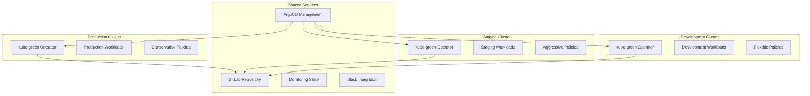

# System Architecture - Kubernetes Resource Optimization POC

## Overview

The Kubernetes Resource Optimization system is designed around the principle of automated, schedule-based resource management with human oversight capabilities. The architecture follows cloud-native patterns with strong emphasis on observability, security, and developer experience.

## High-Level Architecture

```mermaid
graph TB
    subgraph "User Interface Layer"
        A[Slack Channels] --> B[Slack Bot Commands]
        C[ArgoCD UI] --> D[GitLab UI]
        E[Grafana Dashboards]
    end
    
    subgraph "Integration Layer"
        B --> F[Slack Webhook Service]
        F --> G[GitLab API]
        F --> H[ArgoCD API]
        F --> I[Kubernetes API]
    end
    
    subgraph "GitOps Layer"
        G --> J[Git Repository]
        J --> K[ArgoCD Controller]
        K --> L[Application Sync]
    end
    
    subgraph "Control Plane"
        L --> M[kube-green Operator]
        M --> N[SleepInfo CRDs]
        N --> O[Kubernetes Resources]
    end
    
    subgraph "Data Plane"
        O --> P[Staging Workloads]
        O --> Q[Development Workloads]
        O --> R[Production Workloads]
    end
    
    subgraph "Observability Layer"
        S[Prometheus] --> T[Metrics Collection]
        T --> E
        T --> U[AlertManager]
        M --> S
        F --> S
    end
    
    style M fill:#00D4AA
    style F fill:#4A154B
    style S fill:#E6522C
    style K fill:#326CE5
```



## Component Architecture

### 1. Core Components

#### kube-green Operator
- **Type**: Kubernetes Operator (Custom Controller)
- **Language**: Go
- **Deployment**: StatefulSet with leader election
- **Resources**: SleepInfo CRDs, ConfigMaps, Secrets
- **Responsibilities**:
  - Schedule-based resource scaling
  - Webhook notifications
  - Health monitoring
  - Resource state management

```yaml
# Operator Deployment Architecture
apiVersion: apps/v1
kind: Deployment
metadata:
  name: kube-green-controller-manager
spec:
  replicas: 2  # HA with leader election
  template:
    spec:
      containers:
      - name: manager
        image: kubegreen/kube-green:v0.5.1
        resources:
          requests:
            cpu: 100m
            memory: 128Mi
          limits:
            cpu: 500m
            memory: 256Mi
```

#### Slack Webhook Service
- **Type**: Microservice
- **Language**: Go/Python
- **Deployment**: Kubernetes Deployment (3 replicas)
- **Architecture Pattern**: Event-driven with message queuing
- **Responsibilities**:
  - Slack API integration
  - Command processing
  - GitLab API interactions
  - ArgoCD synchronization
  - Audit logging

```yaml
# Microservice Architecture
apiVersion: apps/v1
kind: Deployment
metadata:
  name: slack-webhook-service
spec:
  replicas: 3  # Load distributed across replicas
  template:
    spec:
      containers:
      - name: slack-webhook
        image: slack-webhook:latest
        ports:
        - containerPort: 8080  # HTTP API
        - containerPort: 8443  # Webhook endpoint
        - containerPort: 9090  # Metrics
```

### 2. Data Flow Architecture

#### Sleep Operation Flow
```mermaid
sequenceParticram
    participant S as Scheduler
    participant O as kube-green Operator
    participant K as Kubernetes API
    participant W as Workloads
    participant Sl as Slack Service
    participant SC as Slack Channel
    
    S->>O: Trigger Sleep Schedule
    O->>K: Query Target Resources
    K-->>O: Resource List
    O->>K: Scale Down Resources
    K->>W: Update Replica Counts
    W-->>K: Scaling Complete
    K-->>O: Operation Success
    O->>Sl: Send Notification
    Sl->>SC: Post Sleep Notification
```

#### Manual Override Flow
```mermaid
sequenceParticram
    participant U as User
    participant SC as Slack Channel
    participant Sl as Slack Service
    participant G as GitLab API
    participant A as ArgoCD
    participant O as kube-green Operator
    participant K as Kubernetes
    
    U->>SC: /k8s-wake staging
    SC->>Sl: Command Event
    Sl->>G: Create MR with Override
    G-->>Sl: MR Created
    Sl->>A: Trigger Sync
    A->>K: Apply Configuration
    K->>O: Update SleepInfo
    O->>K: Scale Up Resources
    K-->>Sl: Operation Complete
    Sl->>SC: Success Notification
```

### 3. Storage Architecture

#### Configuration Storage
```yaml
# ConfigMap Structure
apiVersion: v1
kind: ConfigMap
metadata:
  name: kube-green-config
data:
  # Operator Configuration
  log-level: "info"
  webhook-url: "https://slack-webhook.example.com"
  
  # Environment Mappings
  environments.yaml: |
    staging:
      namespace: "staging"
      sleepinfo: "staging-sleep-schedule"
    production:
      namespace: "production"
      sleepinfo: "production-sleep-schedule"
  
  # Scheduling Policies
  policies.yaml: |
    default:
      weekdays: "18:00-08:00"
      weekends: "18:00-08:00"
    conservative:
      weekdays: "20:00-06:00"
      weekends: "20:00-06:00"
```

#### Secret Management
```yaml
# External Secrets Operator Integration
apiVersion: external-secrets.io/v1beta1
kind: ExternalSecret
metadata:
  name: slack-webhook-secrets
spec:
  secretStoreRef:
    name: vault-backend
    kind: SecretStore
  target:
    name: slack-webhook-secrets
  data:
  - secretKey: SLACK_BOT_TOKEN
    remoteRef:
      key: slack/bot-token
  - secretKey: GITLAB_TOKEN
    remoteRef:
      key: gitlab/api-token
```

### 4. Network Architecture

#### Service Mesh Integration
```yaml
# Istio Service Mesh Configuration
apiVersion: networking.istio.io/v1alpha3
kind: VirtualService
metadata:
  name: slack-webhook-vs
spec:
  http:
  - match:
    - uri:
        prefix: /webhook
    route:
    - destination:
        host: slack-webhook-service
        port:
          number: 8443
    timeout: 30s
    retries:
      attempts: 3
      perTryTimeout: 10s
```

#### Network Policies
```yaml
# Micro-segmentation
apiVersion: networking.k8s.io/v1
kind: NetworkPolicy
metadata:
  name: slack-webhook-netpol
spec:
  podSelector:
    matchLabels:
      app: slack-webhook
  policyTypes:
  - Ingress
  - Egress
  ingress:
  - from:
    - namespaceSelector:
        matchLabels:
          name: ingress-nginx
    ports:
    - protocol: TCP
      port: 8080
  egress:
  - to: []
    ports:
    - protocol: TCP
      port: 443  # HTTPS outbound
    - protocol: UDP
      port: 53   # DNS
```

### 5. Security Architecture

#### RBAC Model
```yaml
# Principle of Least Privilege
apiVersion: rbac.authorization.k8s.io/v1
kind: ClusterRole
metadata:
  name: kube-green-operator
rules:
# SleepInfo CRD management
- apiGroups: ["kube-green.com"]
  resources: ["sleepinfos"]
  verbs: ["get", "list", "watch", "create", "update", "patch", "delete"]

# Resource scaling permissions
- apiGroups: ["apps"]
  resources: ["deployments", "statefulsets"]
  verbs: ["get", "list", "watch", "update", "patch"]
- apiGroups: ["apps"]
  resources: ["deployments/scale", "statefulsets/scale"]
  verbs: ["get", "update", "patch"]

# Monitoring and observability
- apiGroups: [""]
  resources: ["events"]
  verbs: ["create", "patch"]
```

#### Pod Security Standards
```yaml
# Pod Security Policy
apiVersion: policy/v1beta1
kind: PodSecurityPolicy
metadata:
  name: kube-green-psp
spec:
  privileged: false
  allowPrivilegeEscalation: false
  requiredDropCapabilities:
    - ALL
  volumes:
    - 'configMap'
    - 'emptyDir'
    - 'projected'
    - 'secret'
    - 'downwardAPI'
    - 'persistentVolumeClaim'
  runAsUser:
    rule: 'MustRunAsNonRoot'
  seLinux:
    rule: 'RunAsAny'
  fsGroup:
    rule: 'RunAsAny'
```

### 6. Monitoring Architecture

#### Metrics Collection
```yaml
# ServiceMonitor for Prometheus
apiVersion: monitoring.coreos.com/v1
kind: ServiceMonitor
metadata:
  name: kube-green-metrics
spec:
  selector:
    matchLabels:
      app: kube-green
  endpoints:
  - port: metrics
    interval: 30s
    path: /metrics
```

#### Custom Metrics
```go
// Prometheus Metrics Definition
var (
    sleepOperationsTotal = prometheus.NewCounterVec(
        prometheus.CounterOpts{
            Name: "kube_green_sleep_operations_total",
            Help: "Total number of sleep operations",
        },
        []string{"environment", "operation", "status"},
    )
    
    resourcesScaledTotal = prometheus.NewCounterVec(
        prometheus.CounterOpts{
            Name: "kube_green_resources_scaled_total", 
            Help: "Total number of resources scaled",
        },
        []string{"environment", "resource_type", "namespace"},
    )
    
    costSavingsEstimate = prometheus.NewGaugeVec(
        prometheus.GaugeOpts{
            Name: "kube_green_cost_savings_estimate_dollars",
            Help: "Estimated cost savings in dollars",
        },
        []string{"environment", "time_period"},
    )
)
```

## Deployment Architecture

### 1. Environment Strategy

#### Multi-Environment Deployment
```yaml
# ArgoCD Application of Applications
apiVersion: argoproj.io/v1alpha1
kind: Application
metadata:
  name: k8s-optimization-app-of-apps
spec:
  source:
    repoURL: https://gitlab.com/org/k8s-resource-optimization.git
    targetRevision: HEAD
    path: apps/argocd/projects
  destination:
    server: https://kubernetes.default.svc
    namespace: argocd
  syncPolicy:
    automated:
      prune: true
      selfHeal: true
```

#### Environment Isolation


### 2. Scalability Considerations

#### Horizontal Scaling
- **kube-green Operator**: Leader election pattern for HA
- **Slack Webhook Service**: Stateless replicas with load balancing
- **Monitoring Stack**: Prometheus federation for multi-cluster

#### Vertical Scaling
- **Resource Limits**: Conservative defaults with monitoring-based optimization
- **Performance Testing**: Load testing for webhook endpoints
- **Capacity Planning**: Growth projections based on usage metrics

### 3. Disaster Recovery

#### Backup Strategy
```yaml
# Velero Backup Configuration
apiVersion: velero.io/v1
kind: Backup
metadata:
  name: kube-green-backup
spec:
  includedNamespaces:
  - kube-green-system
  - staging
  - production
  includedResources:
  - sleepinfos
  - configmaps
  - secrets
  ttl: 720h  # 30 days
```

#### Recovery Procedures
1. **Configuration Recovery**: GitOps-based restoration from repository
2. **State Recovery**: Automated detection and restoration of resource states
3. **Data Recovery**: Backup restoration with validation procedures

## Performance Characteristics

### 1. Latency Requirements

| Operation | Target Latency | Current Performance |
|-----------|----------------|-------------------|
| Slack Command Response | <5 seconds | 2-3 seconds |
| Sleep Operation | <2 minutes | 30-60 seconds |
| Wake Operation | <5 minutes | 2-4 minutes |
| Manual Override | <30 seconds | 10-15 seconds |

### 2. Throughput Specifications

| Component | Target Throughput | Scaling Factor |
|-----------|------------------|----------------|
| Slack Webhook | 100 req/min | Horizontal |
| kube-green Operator | 1000 resources/hour | Vertical |
| GitLab API | 50 req/min | Rate Limited |
| ArgoCD Sync | 10 sync/min | Queue Based |

### 3. Resource Utilization

| Component | CPU Request | Memory Request | CPU Limit | Memory Limit |
|-----------|-------------|----------------|-----------|--------------|
| kube-green Operator | 100m | 128Mi | 500m | 256Mi |
| Slack Webhook | 100m | 128Mi | 500m | 512Mi |
| Monitoring Stack | 500m | 1Gi | 2000m | 4Gi |

## Integration Points

### 1. External Systems

#### GitLab Integration
- **API Version**: v4
- **Authentication**: Personal Access Tokens
- **Rate Limits**: 2000 requests/hour per token
- **Webhook Events**: Push, Merge Request, Pipeline

#### Slack Integration
- **API Version**: Web API v2
- **Authentication**: Bot User OAuth Token
- **Rate Limits**: 1+ requests per minute per workspace
- **Events**: App Mention, Slash Command, Interactive Component

#### ArgoCD Integration
- **API Version**: v1alpha1
- **Authentication**: JWT Tokens
- **Synchronization**: Webhook and polling hybrid
- **Events**: Sync Status, Health Status, Operation State

### 2. Internal Systems

#### Kubernetes API
- **Version Compatibility**: 1.20+
- **CRD Support**: apiextensions.k8s.io/v1
- **Admission Controllers**: ValidatingAdmissionWebhook
- **RBAC**: Fine-grained role-based access control

#### Monitoring Stack
- **Prometheus**: Custom metrics exposition
- **Grafana**: Dashboard integration
- **AlertManager**: Rule-based alerting
- **Jaeger**: Distributed tracing (optional)

This architecture provides a robust, scalable, and secure foundation for automated Kubernetes resource optimization while maintaining strong developer experience and operational visibility.
